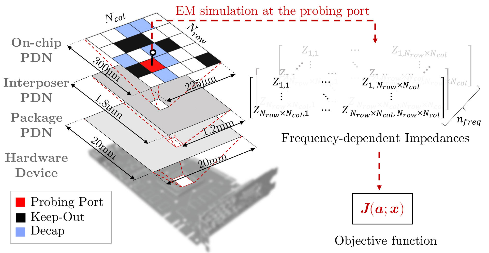
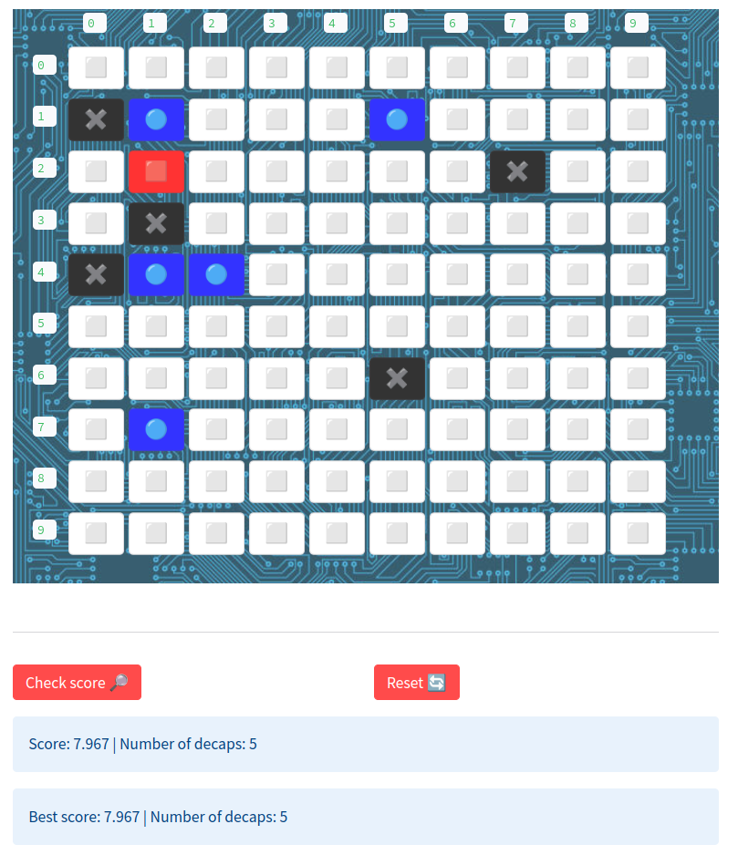

<div align="center">

# DevFormer

[](https://arxiv.org/abs/2205.13225)  [](https://join.slack.com/t/rl4co/shared_invite/zt-1ytz2c1v4-0IkQ8NQH4TRXIX8PrRmDhQ)
 [](https://github.com/psf/black)[](https://www.python.org/downloads/release/python-390/)

<p align="center">
    
</p>

</div>

This repository contains the benchmark for the decoupling capacitor placement problem (DPP) and the accompanying paper "DevFormer: A Symmetric Transformer for Context-Aware Device Placement", accepted at ICML 2023. The benchmark is designed to evaluate the performance of the proposed DevFormer architecture and to facilitate future research in hardware design optimization.


## 📰 News
- September 2024: the DPP has been featured in the NeurIPS 2024 paper [ReEvo](https://github.com/ai4co/reevo), where a new SOTA heuristic was discovered by LLMs
- September 2023: The DPP and its multi-port variants are now available as environments in [RL4CO](https://github.com/ai4co/rl4co)
- May 2023: The paper "DevFormer: A Symmetric Transformer for Context-Aware Device Placement" has been accepted at ICML 2023 🎉

## 📦 Setup

### Install dependencies

After cloning the repository, you can install the dependencies with the following commands:
```bash
git clone https://github.com/ai4co/devformer.git && cd devformer
pip install -e ".[app,dev]"
```

This will also install the development dependencies, which include the necessary packages for running the tests and the Streamlit application.

## 🚀 Usage
### Simulator
* Using the simulator to obtain the cost of a solution:

```bash
from src.problems.dpp.simulator import decap_sim

cost = decap_sim(probe = 23, solution = [1,5,7], keep_out = [2,3,10])
```
### Run and evaluate models

In general, the following command is used to run the models:
```bash
python3 run.py --problem [PROBLEM] --model [MODEL] --training_dataset [DATASET]
```
You may also have a look at the arguments under [src/options.py](src/options.py) for more details.

* How to evaluate pretrained DevFormer

```bash
python3 run.py --problem dpp --model devformer --resume data/dpp/pretrained/CSE_2000_epoch-50.pt --eval_only
```

* How to train DevFormer

```bash
python3 run.py --problem dpp --model devformer --N_aug 4 --training_mode IL --train_dataset data/dpp/training_2000_new.pkl --guiding_action data/dpp/guiding_2000_new.pkl --EE --SE --batch_size 200
```

Additionally, the folder [scripts/](scripts/) contains scripts to reproduce the results in the paper.

### Troubleshooting
- There may be problems on multiple GPUs due to the current handling of DataParallel. You may run `export CUDA_VISIBLE_DEVICES=0` to use only one GPU.
- When running the `run.py` script, if data has not been download it will start downloading automatically. If you want to download the data manually, or if there are any issues with Google Drive, you may access the data at the [following link](https://drive.google.com/file/d/1cANSJRW7STCl_7cWacDajWMXcEUQG1SK/view) and place extract the content of the `.zip` archive at this repository root `.`.

---

## DPP Simulator GUI 🎨
<p align="center">
    
</p>


The application is based on [Streamlit](https://streamlit.io/) which allows for web GUIs in Python. To run the application locally, run the following command:

```bash
streamlit run app.py
```

A web browser should open automatically and you can interact with the application. If it doesn't, you can manually open a browser and navigate to http://localhost:8501.

### Notes on GUI development
The structure of the application is as follows:
```
├── app.py # landing page to `streamlit run`
└── pages/
    ├── about.py # about page in Python (as per Streamlit documentation)
    ├── assets/
    |   └── * # media such as .png images
    └── src/
       └── script.js # javascript file for modifying the GUI
```

Most radical modifications are not supported in Streamlit, so we hack our way and [inject Javascript code](https://www.youtube.com/watch?v=OVgPJEMDkak) to modify elements of the GUI.

### Deploy the app
There are many ways to deploy the app, among which on our own server. However, Streamlit provides a [free hosting service](https://docs.streamlit.io/streamlit-cloud/get-started/deploy-an-app) that is sufficient for our purposes. To deploy the app, simply follow the instructions there or click the "deploy" button after running the app locally!

---


### 🤩 Citation
If you find DevFormer valuable for your research or applied projects:

```
@article{kim2023devformer,
  title={DevFormer: A Symmetric Transformer for Context-Aware Device Placement},
  author={Kim, Haeyeon and Kim, Minsu and Berto, Federico and Kim, Joungho and Park, Jinkyoo},
  year={2023},
  booktitle={International Conference on Machine Learning},
  organization={PMLR}
}
```


---

<div align="center">
    <a href="https://github.com/ai4co">
        
    </a>
</div>